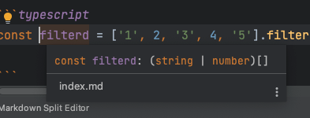

## forEach, map 제네릭 분석

제네릭을 실전적으로 사용하기 전에 forEach 라는 함수를 한번 분석하면 제네릭에 대해서 좀 더 이해하기 쉬울 것.

```typescript
// lib.es5.d.ts
interface Array<T> {
  forEach(callbackfn: (value: T, index: number, array: T[]) => void, thisArg?: any): void;
}

[1,2,3].forEach((item) => {
  console.log(item); // item: number
});

['1', '2', '3'].forEach((item) => {
  console.log(item); // item: string
});
```

value 에 T라고 선언한 자리에서 Value 의 타입을 정의해주면 타입추론이 작동된다.

제네릭을 사용하지 않고 유니언 타입을 사용하게 된다면 경우의 수가 너무 늘어나 예상치 못한 작동이 이루어질 수 있다.

```typescript

interface Array<T> {
  map<U>(callbackfn: (value: T, index: number, array: T[]) => U, thisArg?: any): U[];
}

const strings = [1,2,3].map((item) => item.toString());
```


위 예제에서 T는 number 이다.
U 는 무엇일까? callbackfn 의 리턴 타입은 U 이다.
item.toString() -> string 을 반환하고 있다.

위의 코드를 하나하나 명시적 정의를 하게 되면 이렇게 된다.

```typescript
interface Array<T> {
  map<U>(callbackfn: (value: number, index: number, array: number[]) => string, thisArg?: any): string[];
}
```

## filter 제네릭 분석

filter 같은 경우 타입스크립트가 여러개 정의가 되어있다.


```typescript
interface A<T> {
  filter<S extends T>(predicate: (value: T, index: number, array: T[]) => value is S, thisArg?: any): S[];
  filter(predicate: (value: T, index: number, array: T[]) => unknown, thisArg?: any): T[];
}

const filtered = [1, 2, 3, 4, 5].filter((value) => value % 2);
```


타입 추론은 정상적으로 작동하였다.

위 에제의 경우 리스트에 들어있는 모든 값이 number 이므로 filter의 위 부분이 작동했을 것이다.

value is S 의 값에서 number 의 값만 추론이 되므로 결과 값은 다음과 같다.

```typescript
interface A<T> {
  filter<S extends number>(predicate: (value: number, index: number, array: number[]) => value is number, thisArg?: any): number[];
}
```

```typescript
const filterd = ['1', 2, '3', 4, '5'].filter((value) => typeof value === 'string');
```


위 에제에서 우리는 string 만을 원했는데 (string | number)[] 의 값으로 나왔다.

왜 그런지 보자.

```typescript
interface A<T> {
  filter(predicate: (value: T, index: number, array: T[]) => unknown, thisArg?: any): T[];
}
```

T 라는 값이 이미 (string | number)[] 라는 값을 내뱉고 있어서 불가능하다.
위 경우는 S 라는 return 값을 사용해서 타입이 변환이 가능하지만 이 filter 타입은 T를 그대로 내놓기 떄문에 변경이 안된다.

우리가 원하는 filter 값을 반환하게 하기 위해서는 S 라는 타입을 정확하게 정의해주면 된다.
그렇게 되면 filter<S extends T> 의 조건이 만족하게 될 것이다.

```typescript
interface Array<T> {
  filter<S extends T>(predicate: (value: T, index: number, array: T[]) => value is S, thisArg?: any): S[];
}

const predicate = (value: string | number): value is string => typeof value === 'string';
const filtered = ['1', 2, '3', 4, '5'].filter(predicate); // string[]
```

이 조건이 성공하는 이유는 string extends string | number 에 부합하기 떄문이다.
만약 boolean extends string | number 였다면 다른 필터 타입이 작동했을 것이다.

위의 예제로 제네릭과 커스텀 타입 가드를 한걸음 더 이해하였다.

그렇다면 이런 코드는 작동할까?

```typescript
interface Array<T> {
  filter<S extends T>(predicate: (value: T, index: number, array: T[]) => value is S, thisArg?: any): S[];
}

// Error
const result = ['1', 2].filter<string extends string | number>((value) => typeof value === 'string');
```

직접 적어준다면 정상작동하지 않을까?
결과부터 말하면 안된다.

시그니처 형식 조건이어야 한다는 에러가 발생한다.
위의 조건은 커스텀 타입 가드가 아니라면 작동을 하지 않는다고 한다. **is** 를 만족하지 않았기 떄문이다.?


이런식으로 타입의 분석을 하는 것이 강사의 추천 학습 방법이다.

## forEach 타입 직접 만들기

남의 코드를 분석하는것은 이해헀는데 직접 만들어보기로 하자.

단순히 number 만을 넣는다면 이런 코드로 충분하다.

```typescript
interface Arr {
  forEach(callback: (item: number) => void): void;
}

const a: Arr = [1,2,3];

a.forEach((item) => {
  console.log(item);
});
```

하지만 좀 더 많은 타입들이 forEach 를 사용하게 되면 에러가 날것이다.
string을 포함하면 어떻게 될까?

초반엔 괜찮은 것 같지만 조금의 코드가 추가된 것만으로 에러가 발생한다.

```typescript
interface Arr {
  forEach(callback: (item: string | number) => void): void
}

const a: Arr = [1,2,3];

a.forEach((item) => {
  console.log(item);
  item.toFixed(1); // Error
});
```

이런 유니언 타입의 불정확성을 해결하기 위해 제네릭을 사용한다.

```typescript
interface Arr {
  forEach<T>(callback: (item: T) => void): void
}

const a: Arr = [1,2,3];

a.forEach<number>((item) => {
  console.log(item);
  item.toFixed(1);
});
```

forEach 에 이렇게 명시적으로 집어넣게 된다면 문제가 없지만 의도한 대로 만들어지지 않았다.
제네릭 타입을 제대로 추론하지 못해서 처음에는 unknown 으로 추론되고 있다.

```typescript
interface Arr {
  forEach<T>(callback: (item: T) => void): void
}

const a: Arr<number> = [1,2,3];

a.forEach((item) => {
  console.log(item);
  item.toFixed(1);
});
```