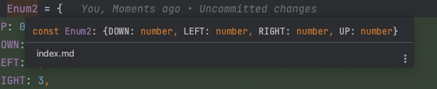
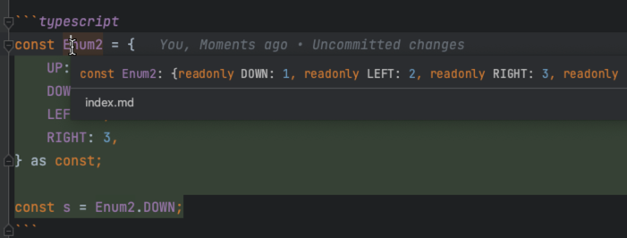

## ! 키워드

document 의 querySelector 를 예로 들어서 head 라는 키워드로 엘리먼트를 찾았다면 Element 아니라면 null 타입을 반환할 것이다.
하지만 뒤에 ! 를 붙이게 된다면 null 이 들어오지 않을 것이라고 사용자가 직접 할당할 수 있다.

모든 책임을 개발자에게 넘길 수 있다.

하지만 추천하지 않는다. 절대로 null 이 안나올 것이라고 개발자가 ! 키워드를 붙이지만 

이 세상에 절대란 없다.

```typescript
const head = document.querySelector('#head');
```

## 원시 래퍼 타입, 템플릿 리터럴 타입, rest, 튜플

### 원시 래퍼

string 과 String 은 서로 다른 타입이다.

```typescript
const s1: string = 'hello';
const s2: String = 'hell';
```

대문자 String 같은 경우에는 빌트인으로 만들때 사용하는 것이다.

```typescript
const s3: String = new String();
```

### rest

rest 에 들어갈 인수들에 대한 타입 정의가 가능하다.

```typescript
function rest(a, ...args: string[]) {
    console.log(a, args); // 1, [2,3]
}

rest(1, '2', '3');
```

### tuple

```typescript
const tuple: [string, number] = ['1', 1];
tuple[2] = 'hello'; // Error

tuple.push('hello'); // not Error
```

### enum

enum 의 경우에도 ts 컴파일 이후 삭제가 되는 코드이다. 

사용방법은 이와 같다.

```typescript
const enum Enum1 {
    UP = 3,
    Down,
    Left,
    Right,
}

const s = Enum1.Down
```

하지만 자바스크립트 내에서 코드를 남겨야 된다고 판단한다면 Enum 과 비슷한 방법으로 남길 수 있다.

```typescript
const Enum2 = {
    UP: 0,
    DOWN: 1,
    LEFT: 2,
    RIGHT: 3,
}

const s = Enum2.DOWN;
```

같은 방법으로 사용할 수 있다. 다만 위와 같이 바로 Enum2 를 정의한다면 타입추론은 Enum 과 다르게 움직이게 된다.

우선 Enum2 에 대한 객체는 열려있고 수정이 가능한 불완전한 객체로 볼 수 있다.

**강의자는 JS에 남길 Enum 을 정의하기 위해 as const 문법을 사용하면 좋다고 하였다.**



다음과 같이 타입이 추론된다. 

나는 UP이 number 가 아닌 상수로 되길 바란다.

```typescript
const Enum2 = {
    UP: 0,
    DOWN: 1,
    LEFT: 2,
    RIGHT: 3,
} as const;

const s = Enum2.DOWN;
```



이렇게 readonly 가 붙어 수정이 불가능하며 상수인 1, 2, 3, 4 가 정확하게 담기게 된다.

이 방법 또한 Enum 과 동일하지만 JS 에 남는다 라는 차이가 있다.

**강의자는 가능하면 자바스크립트 코드를 남기는것을 추천한다.**

Enum 은 타입을 그대로 건내줘서 사용 가능하지만 두번째로 사용한 방법은 그렇지 않다.

따로 타입을 정의해줘서 사용해주어야 한다.

```typescript
const enum Enum1 {
    UP = 3,
    Down,
    Left,
    Right,
};

const Enum2 = {
    UP: 0,
    DOWN: 1,
    LEFT: 2,
    RIGHT: 3,
} as const;

function walk(dir: Enum1) {};
function walk2(dir: Enum2) {}; // Error

type Enum2Type = typeof Enum2[keyof typeof Enum2];

function wal3(dir: Enum2Type) {};
```

---

## 별칭

```typescript
type A = { a: string };
const a: A = { a: 'hello' };

interface B { a: string };
const b: B = {a: 'string'};
```

## Union / intersection

```typescript
type Union = {a: string | number}
```

유니온 타입은 '또는' 이라 자유롭게 타입을 사용 가능하지만

타입 추론이 어려워진다. 타입스크립트는 모든 경우의 수를 생각하기 떄문에

후에 유니온 타입을 사용할 떄 타입 정의가 매우 어려워진다.

'&' 키워드를 사용하면 and 기능을 사용할 수 있다.

```typescript
type Intersection = {a: string & number};
```

