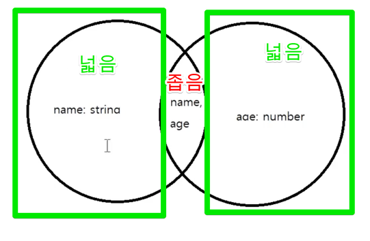

## 타입 에일리언스

인터페이스와 타입과의 차이가 있지만 좀 더 객체지향적으로 프로그래밍을 할 때에는 인터페이스를 사용하는 편이다.

타입과 인터페이스가 완벽하게 분리되어 있는 것이 아닌 표현의 방식의 차이라고 생각하면 좋다.


```typescript
type Animal = { breath: true };
type Mammalia = Animal & { breed: true };
type Human = Mammalia & { think: true };
// 상속 기능 

const me: Human = { breath: true, think: true, breed: true }

interface A {
    breath: true
}

interface B extends A {
    breed: true
}

// 인터페이스에 type 을 상속할 수도 있다.

interface C extends Human {
    
}
```

하지만 인터페이스는 같은 이름으로 선언이 가능하다. 여러번 선언할 때마다 합쳐진다.

**interface, enum, type 같은 경우 변수에 I,E,T를 맨 앞에 붙이지만 요즘에는 안붙이는 추세라고 한다?**

## 타입을 집합으로 생각하자.

좁은 타입에서 넓은 타입으로 대입이 가능하다.
넓은 타입에서 좁은 타입으로 대입이 불가능하다.

```typescript
// 넓은 타입
type A = string | number;
// 좁은 타입
type B = string;
```

객체는 상세할수록 좁은 타입이다.


```typescript
// 넓은 타입
type A = { name: string };
type B = { age: number };
// 좁은 타입
// type C = { name: string, age: number };
type AB = A | B;
type C = A & B;

// C는 좁은 타입이며 AB 는 넓은 타입이다. 그러므로 c는 ab를 대입할 수 없다.
const ab1: AB = { name: 'name' };
const c1: C = ab1; // Error

// AB는 넓은 타입이며 C는 좁은 타입이다.
const c2: C = { name: 'name', age: 1 };
const ab2: AB = c2; // OK

const ab3: AB = { name: 'name' };

// C 라는 좁은 타입에 married 라는 넓은 타입을 대입했지만 에러가 나온다.
// 객체의 리터럴을 검사할 때 잉여 속성 검사라는 추가 검사를 한다.
// 변수로 따로 빼서 정의를 해준다면 잉여 속성 검사를 실행하지 않는다.
const c3: C = { name: 'name', age: 1, married: false }; // married False is not defined
```

## void 의 사용법

return 값이 없는 것을 뜻한다.

```typescript
// 하지만 undefined 는 반환 가능하다.
function a(): void {
    return undefined;
}
```

리턴값이 void 일 경우와 매개변수가 void 인 경우, 메서드로 선언한 void, 세 가지로 나눌 수 있다.

함수의 직접적인 리턴값이 void 의 경우에만 return 값을 아무것도 보내서 안되며.
메서드의 void 는 **리턴값을 사용하지 않겠다는 의미**
```typescript
function a(callback: () => void): void {
    
}

a(() => {
    return '3';
});

interface Human {
    talk: () => void;
};

const human: Human = {
    talk() { return '123' }
};

const aa = human.talk() as number; // Error
const bb = human.talk() as unknown as number // Error
```

```typescript
// 함수의 타입을 선언하고 구현도를 만들지 않으면 에러가 발생한다.
// Function implementation is missing or not immediately following the declaration
// function forEach(arr: number[], callback: (el: number) => undefined): void;

// declare 를 선언하면 해당 오류는 사라진다. 다만 자바스크립트 변환시 코드가 삭제된다.
// undefined , void 의 차이 다시한번 말하면 메서드 void는 리턴 값을 사용하지 않겠다는 뜻.
declare function forEach2(arr: number[], callback: (el: number) => undefined): void;

let target: number[] = [];
forEach2([1,2,3], el => target.push(el)); // Error push 의 return 값은 number
```